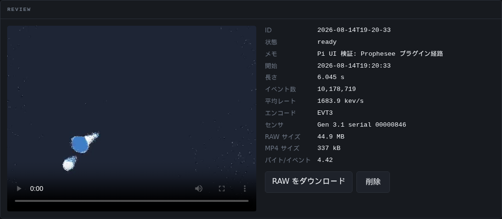

# EvCam — SilkyEvCam 録画システム

イベントカメラ **CenturyArks SilkyEvCam**（Prophesee Gen3.1 センサ, 640x480）を
オープンソースの **OpenEB** だけで動かし、ブラウザから録画・定期録画・レビューを行うシステム。
有償の Metavision SDK は使わない。x86-64 の Ubuntu と Raspberry Pi 5（aarch64）の両方で動作する。

- **ライブプレビュー** — イベントストリームをブラウザでリアルタイム表示
- **手動録画** — ワンクリックで EVT3 RAW を無損失記録、MP4 プレビューを自動生成
- **定期録画（スケジューラ）** — 毎日の時間帯・チャンク長・保存先を設定して自動録画
- **レビュー** — 録画一覧・ブラウザ再生・RAW ダウンロード・削除
- **CLI ツール** — 動き検知・レイテンシ計測・オフラインベンチ




検証・計測・設計判断の記録は **[docs/tech-notes.md](docs/tech-notes.md)** にある。
この README はセットアップと使い方だけを説明する。

## 必要なもの

| 対象 | 要件 |
|---|---|
| カメラ | CenturyArks SilkyEvCam（VGA, USB3）。Prophesee EVK もそのまま動く |
| マシン | Ubuntu 22.04/24.04 (x86-64) または Raspberry Pi 5 / ARM64 Linux（Debian 12+ 相当） |
| ストレージ | 録画は最大 20 MB/s 程度の連続書き込みになる。Pi では NVMe HAT か USB SSD を推奨 |

## セットアップ

OpenEB 5.2.0 をソースからビルドして使う（ローカルビルドツリー方式。`~/.bashrc` や
システムディレクトリは汚さない）。x86-64 と ARM でカメラ用プラグインの入手方法だけが違う。

### 共通: 依存パッケージと OpenEB のビルド

```bash
# 1. 依存パッケージ（要 root）
sudo apt-get install -y cmake git curl ffmpeg libboost-all-dev libusb-1.0-0-dev \
  libprotobuf-dev protobuf-compiler libhdf5-dev libglew-dev libglfw3-dev \
  libopencv-dev python3-dev python3-venv

# 2. Python 環境
python3 -m venv .venv
.venv/bin/python -m pip install numpy opencv-python h5py scipy pytest \
  "pybind11==2.13.6" fastapi "uvicorn[standard]"

# 3. OpenEB 5.2.0 の取得とビルド（CUDA の有無は自動判別。Pi 5 で約 7 分）
git clone https://github.com/prophesee-ai/openeb.git --branch 5.2.0
./scripts/build_openeb.sh
```

バージョンは **OpenEB 5.2.0 / pybind11 2.13.6 に固定**（理由は
[tech-notes](docs/tech-notes.md) 参照）。勝手に上げないこと。

### A. x86-64（Ubuntu）: CenturyArks 配布プラグインを使う

```bash
./scripts/fetch_plugin.sh        # プラグイン zip を取得して vendor/ に配置
```

### B. Raspberry Pi / ARM64: OpenEB へ 1 行パッチ

CenturyArks のプラグインは x86-64 バイナリしか配布されていないが、
**Prophesee 純正プラグインに USB ID を 1 行足すだけで SilkyEvCam は動く**
（[検証記録](docs/tech-notes.md)）。

```bash
./scripts/probe_silky_usb.sh                    # カメラを挿して USB 条件を確認
./scripts/try_psee_plugin_with_silky.sh         # 1 行パッチ + プラグインのみ再ビルド
```

同一マシンで A と B を併用しないこと（スクリプトが検出して拒否する）。

### 共通: udev ルール（要 root、初回のみ）

```bash
sudo cp scripts/ca_device.rules /etc/udev/rules.d/
sudo udevadm control --reload-rules && sudo udevadm trigger --action=add
```

### 動作確認

```bash
source ./env.sh                  # このシェルでだけ環境が有効になる
metavision_hal_ls                # → "Device detected: ..." が出れば OK
python scripts/smoke_test.py     # 3 秒キャプチャしてイベント数を表示
```

## 使い方

### 録画サーバ（ブラウザ UI）

```bash
source ./env.sh
python -m recorder.app --host 0.0.0.0     # → http://<マシンの IP>:8000
```

カメラは排他アクセスなので、サーバ起動中は `metavision_viewer` 等と同時に使えない。

**live パネル** — ライブプレビューと、イベントレート・録画時間・ファイルサイズ・
書き込みレート・ディスク残量（現在のレートからの残り時間つき）。
メモを添えて「録画開始」で手動録画。RAW は EVT3 のまま無損失で保存され、
停止すると閲覧用の H.264 MP4 が自動生成される。

**schedule パネル** — 定期録画の設定。「設定を保存」で反映され、サーバを再起動しても引き継がれる。

| 設定 | 意味 |
|---|---|
| 時間帯 | 毎日繰り返し。開始 > 終了は夜跨ぎ（例 22:00→06:00）。開始 == 終了で 24 時間 |
| チャンク | 5/10/20/30/60 分。境界は壁時計に揃う（10 分なら :00, :10, …）ので録画 ID から時刻が読める |
| 保存先 | 空欄で `out/recordings`。相対パスはリポジトリ基準。録画中の変更は拒否される |
| 空き容量の下限 | これを切ると新しいチャンクを開始しない（ディスクを食い潰さないための安全装置） |

手動録画とは共存する（スケジューラは自分が開始した録画だけを止める）。

**recordings / review パネル** — 録画をクリックすると詳細（長さ・イベント数・
平均レート・センサ情報・サイズ）と MP4 再生。RAW のダウンロードと削除もここから。

### HTTP API

UI と同じ API を外部からも叩ける（スケジューラや自動化の組み込み用）:

| メソッド | パス | 用途 |
|---|---|---|
| GET | `/api/status` | 接続状態・イベントレート・録画状態・残容量 |
| GET | `/api/preview.jpg` | ライブの 1 フレーム（JPEG） |
| GET | `/api/preview.mjpg` | ライブストリーム（MJPEG） |
| POST | `/api/record/start` | 録画開始 `{"note": "..."}` |
| POST | `/api/record/stop` | 停止 → 後処理 |
| GET / PUT | `/api/scheduler` | 定期録画の設定と状態 |
| GET | `/api/recordings` | 録画一覧 |
| GET | `/api/recordings/{id}/preview.mp4` | MP4 |
| GET | `/api/recordings/{id}/events.raw` | RAW |
| DELETE | `/api/recordings/{id}` | 削除 |

### CLI ツール

```bash
./scripts/build_tools.sh          # src/ の C++ ツールをビルド（初回のみ）

metavision_viewer                 # 公式ライブビューア
./build/motion_viewer             # 動き検知の可視化（検知セルをオーバーレイ）
./build/motion_probe --help       # 動き検知の計測（パラメータ掃引用）
./build/latency_probe --seconds 10   # 配送レイテンシの計測
./build/trigger_probe --seconds 10 --period 8600   # trigger loopback 検証
python scripts/offline_bench.py samples/dense.raw  # デコード性能ベンチ（カメラ不要）
```

各ツールの背景・実測値・パラメータの選び方は [docs/tech-notes.md](docs/tech-notes.md)。

## 既知の制約

- **Gen3.1 VGA に ERC（イベントレート制限）は無い。** データ量の制御はバイアスと ROI で行う
- タイムスタンプの単調性に依存する解析は `MV_FLAGS_EVT3_ROBUST_DECODER=1` を付けて
  デコードすること（センサが稀に出す EVT3 プロトコル癖を既定デコーダは素通しする）
- 静止シーンでも記録レートは約 0.3 MB/s ある（EVT3 のタイムスタンプマーカー分）。
  「何も映らなければタダ」ではない
- チャンク切替の境界で数十 ms〜数秒の録画欠落がある（ストリームは止めない）

いずれも詳細と実測は [docs/tech-notes.md](docs/tech-notes.md) にある。
