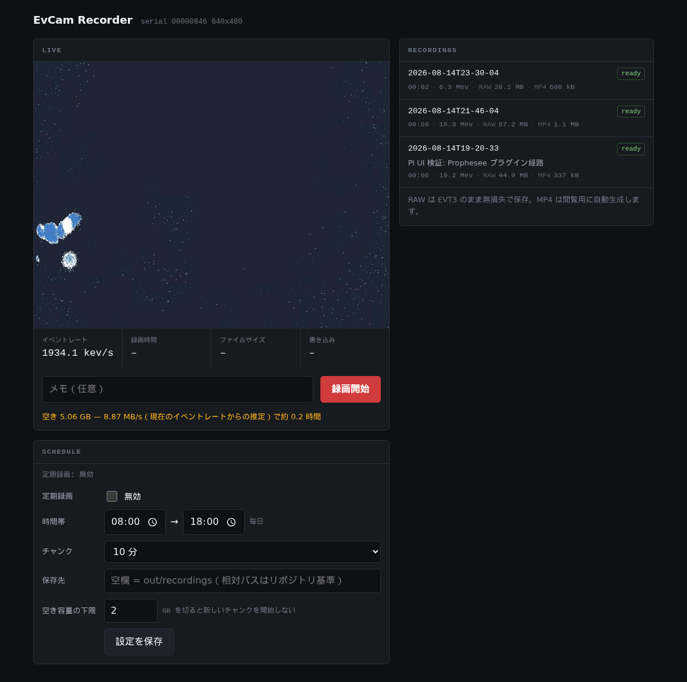

# EvCam 技術ノート（検証と設計の記録）

セットアップ手順と各機能の使い方は [README](../README.md) にある。
このファイルは、その結論に至るまでの**検証・計測・設計判断・踏んだ罠の記録**。
数値はすべて実測で、測定条件も併記してある。読み物としては長いので、
目次代わりに見出しを検索して使うこと。

CenturyArks **SilkyEvCam** を Ubuntu 24.04 で動かすための環境。
Prophesee の **OpenEB**（Metavision SDK の OSS 部分, Apache 2.0）をソースからビルドして使う。
有償の Metavision SDK は使わない。

## 使い方

```bash
source ./env.sh                   # リポジトリ直下で

metavision_viewer                 # ライブ表示
python scripts/smoke_test.py      # 疎通確認（イベント数を出す）
```

`env.sh` を source したシェルでのみ有効。`~/.bashrc` は変更していない。

## 構成

```
SilkyEvCam (USB3, VID 31f7)
      ↓
libsilky_common_plugin.so     CenturyArks 製 HAL プラグイン。MV_HAL_PLUGIN_PATH で発見される
      ↓
libmetavision_hal.so.5        OpenEB。EVT3 デコード
      ↓
metavision_viewer / metavision_core (Python)
```

**このプラグインは必須ではない。** OpenEB 同梱の Prophesee プラグインに USB ID を 1 行足すだけでも
同じように動くことを確認済み（Raspberry Pi での検証で判明。「①' 解決」参照）。
CenturyArks 版は x86-64 バイナリしか配布されていないため、arm64 ではそちらの経路を使う。

```
EvCam/
├── env.sh                    環境設定（これを source する）
├── openeb/                   OpenEB 5.2.0 ソース + build/（git 管理外）
├── vendor/
│   ├── SilkyEvCam_Plugin_Installer_for_ubuntu_v5.2.0.zip
│   ├── silkyevcam-plugin/    展開したもの（git 管理外）
│   └── silky-hal/            実際に使う配置
│       ├── plugins/libsilky_common_plugin.so
│       └── bin/silkyevcam_platform_info, silkyevcam_mask_pixel_util
├── scripts/smoke_test.py
└── .venv/                    Python 3.12 venv（git 管理外）
```

## バージョン固定

**OpenEB は 5.2.0 に固定。** プラグインの `readme.txt` に明記されている:

> This pack is for Metavision version 5.2.0. Cannot be used with version 5.1.1 or earlier

OpenEB を上げるときは、必ず https://centuryarks.com/download-2/ から対応するプラグインも上げること。

## セットアップ手順（実際に通したもの）

以下は Ubuntu の母艦（x86-64 + CUDA + CenturyArks プラグイン）での手順。
**Raspberry Pi / ARM 機は「Raspberry Pi で動かす（まとめ）」の手順を使うこと**
（プラグインの入手方法が根本的に違う）。

### 1. 依存パッケージ（要 root）

```bash
sudo apt-get update
sudo apt-get install -y cmake libboost-all-dev libusb-1.0-0-dev \
  libprotobuf-dev protobuf-compiler libhdf5-dev libglew-dev libglfw3-dev
```

`libopencv-dev` / `ffmpeg` / `build-essential` は導入済みだった。

### 2. Python venv

Ubuntu 24.04 は PEP 668 でシステム Python への pip を拒否するため venv に隔離。

```bash
python3 -m venv .venv
.venv/bin/python -m pip install numpy opencv-python h5py scipy pytest
.venv/bin/python -m pip install "pybind11==2.13.6"
.venv/bin/python -m pip install fastapi "uvicorn[standard]"   # recorder/ 用
```

**pybind11 は 2.13.6 に固定。** OpenEB 5.2.0 は `find_package(pybind11 2.7)` で 2.x 系を前提にしており、
最新の 3.1.0 は API 非互換のリスクがある。

### 3. OpenEB のビルド

```bash
EVCAM_ROOT="$(pwd)"
git clone https://github.com/prophesee-ai/openeb.git --branch 5.2.0

cmake -S openeb -B openeb/build \
  -DCMAKE_BUILD_TYPE=Release \
  -DBUILD_TESTING=OFF \
  -DCOMPILE_PYTHON3_BINDINGS=ON \
  -DPython3_EXECUTABLE="${EVCAM_ROOT}/.venv/bin/python" \
  -Dpybind11_DIR="$("${EVCAM_ROOT}/.venv/bin/python" -c 'import pybind11; print(pybind11.get_cmake_dir())')" \
  -DCMAKE_CUDA_COMPILER=/usr/local/cuda/bin/nvcc \
  -Wno-dev

cmake --build openeb/build -- -j$(nproc)
```

`install` はしない（ローカルビルドツリー方式）。

### 4. プラグイン配置

```bash
./scripts/fetch_plugin.sh
```

プラグインは CenturyArks の proprietary バイナリなのでリポジトリには含めていない
（`LICENSE_CA.txt`: "may be used only when using CenturyArks's products or services"）。
上記スクリプトが zip を取得して `vendor/silky-hal/` に配置する。

**同梱の `CA_Silky_installer.sh` は使わない。** あれは
`~/.bashrc` に `export MV_HAL_PLUGIN_PATH=...` を追記し、`/usr/lib/CenturyArks/` と `/usr/bin` に
system-wide でファイルを置くため、ローカルツリー方式と衝突する。
インストーラの残りの仕事は udev ルールだけなので、それは手動で入れる（次項）。

### 5. udev ルール（要 root）

```bash
sudo cp vendor/silkyevcam-plugin/.../resources/ca_device.rules /etc/udev/rules.d/
sudo udevadm control --reload-rules && sudo udevadm trigger
```

中身:

```
KERNEL=="*", SUBSYSTEM=="usb", ENV{DEVTYPE}=="usb_device", ACTION=="add", ATTR{idVendor}=="31f7", MODE="666", TAG="causb_dev"
```

SilkyEvCam は **VID `31f7`（CenturyArks）**。Prophesee の `88-cyusb.rules`（VID `04b4`）は
Prophesee EVK 用なので**入れていない**。

## ハマりどころ

### cmake 4.2.0 は問題なかった

この PC の `cmake` は `/usr/local/bin` に手動導入された 4.2.0。OpenEB が古い
`cmake_minimum_required` を使っていると configure が落ちる懸念があったが、実測では警告のみ:

```
CMake Deprecation Warning at CMakeLists.txt:20 (cmake_minimum_required):
  Compatibility with CMake < 3.10 will be removed from a future version of CMake.
```

apt の cmake 3.28.3 も入れてあるが、必須ではない。

### CUDA は PATH に無い

CUDA 13.0 は入っているが `/usr/local/cuda/bin` が PATH に無く、そのままだと
`Looking for a CUDA compiler - NOTFOUND` で黙って CPU のみのビルドになる。
`-DCMAKE_CUDA_COMPILER=/usr/local/cuda/bin/nvcc` を明示すること。

### setup_env.sh は MV_HAL_PLUGIN_PATH を上書きする

`openeb/build/utils/scripts/setup_env.sh` は `MV_HAL_PLUGIN_PATH` を
OpenEB 自身のプラグインパスで**上書き**する。Silky プラグインの追加は必ずこの後に
**追記**すること（`env.sh` はそうしている）。

## レイテンシについて

目標は end-to-end で数 ms 以内。支配要因は以下（OpenEB のソースを読んで確認）。

### ① アプリ層のスライシング

Python の `EventsIterator` は `delta_t` 分バッファしてから返すので、窓幅がそのまま
レイテンシの床になる（`events_iterator.py:54`、デフォルト 10 ms）。
**数 ms を狙う経路に Python は使わない。** C++ の
`camera.cd().add_callback()`（`sdk/modules/stream/cpp/include/metavision/sdk/stream/camera.h:277`）
ならデコード済みバッファが届いた時点で即コールバックされる。

### ② USB 転送層

`hal_psee_plugins/src/boards/utils/psee_libusb_data_transfer.cpp:34-36`:

```cpp
constexpr size_t USB_TIME_OUT                = 100;        // ms
constexpr size_t N_ASYNC_TRANFERS_PER_DEVICE = 20;
constexpr size_t PACKET_SIZE                 = 128 * 1024;
```

環境変数で上書きできる。CenturyArks プラグインは OpenEB 5.2.0 の `hal_psee_plugins` を
そのままビルドしたものなので（`strings` でビルドパス `openeb520Silky` を確認）、同じ変数が効く:

- `MV_PSEE_DEBUG_PLUGIN_USB_PACKET_SIZE`
- `MV_PSEE_DEBUG_PLUGIN_USB_ASYNC_TRANSFER`
- `MV_PSEE_DEBUG_PLUGIN_USB_TIME_OUT`

**誤解しやすい点が 2 つある。**

`:219` のコメント `// Note: unlike raw libusb, partial transfers are reported as completed` のとおり、
FX3 が短パケットで区切れば 128 KiB 未満でも即届く。**PACKET_SIZE は上限であって下限ではない。**
実際の遅延は FX3 ファーム（クローズド）の挙動次第なので、**実測が要る**。

`:208-216` の `LIBUSB_TRANSFER_TIMED_OUT` は「データがゼロだった」ケースで、バッファは
破棄されず再投入されるだけ。**`MV_PSEE_DEBUG_PLUGIN_USB_TIME_OUT` を下げてもレイテンシは下がらない。**

### ③ ERC はこのカメラには無い

当初「ERC（Event Rate Controller）でイベントレートに上限をかけて最悪レイテンシを
有界にする」と見込んでいたが、**Gen3.1 VGA には ERC が実装されていない**。
実機で facility を引くと `None` が返る:

```
get_i_erc_module                          -> None
get_i_event_trail_filter_module           -> None   (STC/Trail filter)
get_i_antiflicker_module                  -> None
get_i_digital_crop                        -> None
get_i_digital_event_mask                  -> None
```

これらは IMX636（Gen4.1 = SilkyEvCam HD）の機能。Gen3.1 で使えるのは
`I_LL_Biases` と `I_ROI` のみ。輻輳を抑えたいならバイアスで感度を下げるか
ROI でデータ量を削るしかない。

### ④ 無関係なもの

**CUDA はキャプチャレイテンシには効かない**（下流の推論用）。

## レイテンシ実測結果

計測ツール: `src/latency_probe.cpp` → `scripts/build_tools.sh` でビルド。

```bash
source env.sh
./scripts/build_tools.sh
./build/latency_probe --seconds 10
./scripts/latency_sweep.sh 8      # USB パラメータ掃引
```

### 結論: 約 4 ms の配送周期がハードな下限。host 側のチューニングでは下がらない

Gen3.1 VGA / デフォルト設定 / 静止シーン / warmup 500 ms 除外:

| 指標 | mean | p50 | p90 | p99 | max |
|---|---|---|---|---|---|
| lag (バッチ内で最も古いイベント) | 3.80 ms | 3.89 | 4.08 | 4.20 | **5.12 ms** |
| lag (バッチ内で最も新しいイベント) | 0.36 ms | 0.28 | 0.78 | 1.42 | 2.55 ms |
| コールバック間隔 | 4.000 ms | 3.999 | 4.07 | 4.19 | 5.85 ms |
| バッチのセンサ時間幅 | 3.44 ms | 3.55 | 3.87 | 3.96 | 3.99 ms |

コールバック間隔の中央値が **3.999 ms** と異常なほど安定している。これは FX3 ファームウェアが
内部タイマで約 4 ms ごとにバッファをコミットしているため。結果として個々のイベントの
上乗せ遅延は 0〜4 ms に一様分布し、平均約 2 ms、実測最悪 5.1 ms になる。

### USB パラメータ掃引: 効果なし

`scripts/latency_sweep.sh` の結果（`lag_p99`）:

| 設定 | rate | lag_p99 |
|---|---|---|
| packet 128 KiB (default) | 29 kev/s | 4225 us |
| packet 32 KiB | 73 kev/s | 4219 us |
| packet 8 KiB | 358 kev/s | 4189 us |
| packet 4 KiB | 3.5 kev/s | 4187 us |
| async 20 (default) | 515 kev/s | 4208 us |
| async 4 | 3.2 kev/s | 4166 us |
| async 2 | 3.4 kev/s | 4201 us |

**`lag_p99` は全条件で 4.17〜4.23 ms に張り付く。** イベントレートが 3.4 kev/s 〜 515 kev/s と
150 倍変わっても動かない。つまりホスト側のバッファリングではなくカメラ側の配送周期が支配的で、
`MV_PSEE_DEBUG_PLUGIN_USB_PACKET_SIZE` も `_ASYNC_TRANSFER` も**レイテンシには効かない**。

### 測定手法上の注意（2 つとも実際に踏んだ）

**1. ベースラインに全区間の最小値＋一次回帰を使ってはいけない。**
EVT3 の `NonMonotonicTimeHigh` が 1 回混ざるだけで回帰が壊れ、初回計測では
ドリフト **-5800 ppm**（非現実的）、`lag_p50` 32 ms という汚染された数値が出た。
前後 1 秒の**移動最小値**をベースラインにすると、ドリフトは 16〜20 ppm という妥当な値に収まり、
孤立したタイムスタンプ跳びにも影響されない。

**2. 起動直後の約 250 ms を捨てること。**
`camera.start()` 直後は FX3 側に溜まっていた分がまとめて降ってくるため、
`lag_max` が全条件で約 251 ms に張り付いていた。`--warmup 500`（デフォルト）で除外すると
**251,172 us → 5,123 us** になる。定常時の挙動を見たいならこれを含めてはいけない。

**3. `NonContinuousTimeHigh` は警告ではない。**
robust デコーダを使うと 10 秒で 1274 件出るが、これは疎なシーンで `time_high` が
2 段以上飛んだだけで正常。`NonMonotonicTimeHigh` とは区別して扱うこと
（`latency_probe` は種類別に数えている）。

### 測れていないもの

報告値は**ベストケースからの上乗せ分**であって絶対レイテンシではない。
センサ時刻と host 時刻は同期していないので、未知の定数オフセット
C（光子到達 → センサ読み出し → USB 転送 → デコードの最小遅延）が分離できない。

絶対値が必要なら外部刺激が要る:

- host が既知時刻に GPIO で LED を光らせ、その輝度変化イベントが返ってくるまでを測る
- または `I_TriggerIn` に既知時刻の信号を入れる（要配線）

### 数 ms 目標に対する評価

目標「数 ms 以内」に対し、**平均 約 2 ms / p99 約 4.2 ms**（+ 未測定の定数 C）。
ただし約 4 ms はカメラファームウェア由来のため、**ここから下げる手段はホスト側には無い**。
さらに詰めるなら CenturyArks にファームウェアのコミット周期を問い合わせる必要がある。

## trigger loopback による検証（配線不要）

`src/trigger_probe.cpp`。**Raspberry Pi も host GPIO も要らない。**

このカメラは `I_TriggerOut`（周期パルス生成）と `I_TriggerIn` を両方持ち、
TriggerIn には **LOOPBACK チャネル**がある（`get_available_channels()` →
`{Channel.MAIN: 0, Channel.LOOPBACK: 6}`）。つまりカメラが自分でパルスを出し、
自分でタイムスタンプを打てる。**単一クロックドメインなので同期問題が消える。**

```bash
./build/trigger_probe --seconds 10 --period 8600
```

### 結果: 配送グリッド 4.00 ms を独立に確認

エッジ間隔 4300 us（4 ms と非整数比なので位相が掃引される）で 10 秒:

| 指標 | mean | p50 | p90 | p99 | max |
|---|---|---|---|---|---|
| sensor edge interval | 4300.0 | 4300.0 | 4300.0 | 4300.0 | **4300.0** us |
| host arrival lag | **2045.9** | 2034.0 | 3633.0 | **4025.0** | 7656.0 us |

**`sensor edge interval` は 2328 エッジ全部が 4300.0 us**（max まで一致）。
センサ側のタイムベースにジッタが無く、完璧な基準信号として使える。

そのうえで `host arrival lag` は **[0, 4000 us] の一様分布そのもの**
（mean 2046 ≒ 4000/2、p50 2034、p99 4025）。エッジ間隔 3333 us でも同じ結果。

シーンにもイベントレートにも依存しない完全周期信号で測ってこうなるので、
**配送グリッドが 4.00 ms であることが独立に確定した**。
`latency_probe` のシーン依存な測定と完全に一致する。

つまり任意のイベントのグリッド待ち時間は **平均 2.0 ms / 最悪 4.0 ms**。

## 絶対レイテンシの測定（Step 2、要 LED 配線）

残る未知量は定数 C（光子到達 → センサタイムスタンプ）だけ。これは
**trigger_out の外部端子に LED を付けてセンサに向ければ測れる**:

```bash
./build/trigger_probe --optical --seconds 20
```

Δ = `t_cd(発光)` − `t_trigger(loopback)` を出す。**両方センサクロックなので
オフセット未知の問題が発生しない。**

### trigger_out の端子（仕様書で確定）

出典: [SilkyEvCam-USB_Spec_Rev102.pdf](https://www.centuryarks.com/images/product/sensor/silkyevcam/SilkyEvCam-USB_Spec_Rev102.pdf) P6 Table 4
（`vendor/docs/` にも保存。gitignore 対象）

USB Type-C とは別に **IX Series コネクタ（HIROSE **IX80G-B-10P**）** が背面にある。
嵌合プラグは `IX30G-B-10S-CV(7.0)` または `IX31G-B-10S-CV(7.0)`。
**標準付属品は USB3.0 Type-C ケーブルのみで、trigger ケーブルは付属しない。**

| Pin | Signal | Pin | Signal |
|---|---|---|---|
| 1 | **TRIGGER_OUT / SYNC_OUT_P (+3.3V)** | 6 | TRIG_IN_N — opto-coupled |
| 2 | **SYNC_OUT_N** | 7 | No use |
| 3 | SYNC_IN_P — opto-coupled | 8 | No use |
| 4 | SYNC_IN_N — opto-coupled | 9 | No use |
| 5 | TRIG_IN_P — opto-coupled | 10 | No use |

master 時は **pin 1 & 2** に出力が出る。用途は 2 択:

- `TRIGGER_OUT`: 周期・デューティがプログラム可能なパルス ← **`I_TriggerOut` で叩いているのはこれ**
- `EXT_SYNC_CLK_OUT`: 1 MHz 同期クロック

slave 時は pin 3 & 4 に 1 MHz クロック、pin 5 & 6 に `MAIN_TRIGGER_IN` を受ける。

**注意 1: TRIG_IN 側はフォトカプラ入力。** 他機材と同期させる用途では
フォトカプラの伝搬遅延（素子次第で 1〜10 us 以上）が乗る。
今回使っている **LOOPBACK チャネルは内部経路なのでフォトカプラを通らない**。

**注意 2: pin 1 は 3.3V の P/N ペア。** LED を直接ドライブできる電流は期待できないので
MOSFET かトランジスタでバッファする。P/N が LVDS なのか 3.3V CMOS + 相補出力なのかは
仕様書に明記が無いため、オシロで確認するのが確実。

必要なもの:

- HIROSE の嵌合プラグ `IX30G-B-10S-CV(7.0)` / `IX31G-B-10S-CV(7.0)`
  （手組しにくいので CenturyArks から完成ケーブルを買う方が現実的）
- MOSFET / トランジスタ + LED + 電流制限抵抗
- LED をセンサに向ける

### センサ自体のレイテンシは仕様書に載っている

同 PDF P5 Table 1 より、センサ（PPS3MVCD / PROPHESEE）の

> **Typical Latency 200us**
> Maximum readout throughput 50Mevents/s

つまり未知定数 C のうち支配項は **約 200 us** とメーカー公称値がある。
4.00 ms の配送グリッドに対して **5% 程度**にすぎない。

したがって絶対レイテンシの内訳はほぼこう見積もれる:

```
絶対レイテンシ ≒ 200 us (センサ)  +  0〜4000 us (配送グリッド待ち)  +  小 (USB 転送 + デコード)
             ≒ 平均 2.2 ms / 最悪 4.3 ms
```

**Step 2 の LED 測定は「200 us の検証」という位置づけに下がる。**
数 ms 目標の判断には既に十分な材料が揃っている。

### なぜ Raspberry Pi を（刺激源として）使わないか

（注: 「Pi ではカメラが動かない」と当初書いていたが、これは後に解決した —
「Raspberry Pi で動かす（まとめ）」参照。ここでの論点は LED 刺激源としての Pi で、
その結論は今も変わらない。）

1. **Pi を別マシンの刺激源にすると悪化する。** Pi と host のクロックを 4 ms より
   十分細かく同期する必要があるが、chrony/NTP は ms オーダー＝測りたい量と同じ桁。
   ハードウェアタイムスタンプ付き PTP なら足りるが、労力に見合わない
2. **そもそも不要。** カメラが trigger_out + LOOPBACK を持っているので単一
   クロックドメインで完結する

## 動き検知（`src/motion_probe.cpp`）

```bash
source env.sh
./build/motion_probe --seconds 10
./build/motion_probe --count 40 --window 300 --cell 16 --nnfilter 1000 --quiet
```

セル内のイベント数がスライディング窓で閾値を超えたら検知し、標準出力に出す。
検知レイテンシを自己計測する。

### 検知レイテンシの内訳

```
[動きが起きる]
   ↓ ① 閾値を越える輝度変化が溜まるまで   ← バイアス・照明次第。可変
[画素が発火]
   ↓ ② 200 us（センサ公称）
[タイムスタンプ]
   ↓ ③ 0〜4000 us（配送グリッド。実測済み・固定）
[コールバック]
   ↓ ④ 判定処理
[検知]
```

### 実測（シーンに依存しない部分）

| 指標 | mean | p50 | p90 | p99 | max |
|---|---|---|---|---|---|
| ④ compute | 1.9 | 1.0 | 4.0 | 8.0 | 26.0 us |
| ②+③ event → detect lag | 1980 | 1862 | 3586 | 4095 | 7280 us |

**④ は p50 1 us / p99 8 us で無視できる。** 判定ロジックはボトルネックではない。
②+③ は予想どおり [0, 4000 us] の一様分布で、配送グリッドが支配的。

つまり **絶対検知レイテンシ ≒ 200 us + 平均 2.0 ms（最悪 4.1 ms）+ ①**。

### 使えるパラメータ

センサ側（`I_LL_Biases`、実機のレンジ）:

| バイアス | 現在値 | レンジ | 効き |
|---|---|---|---|
| `bias_diff_on` | 384 | 0–1800 | ON 側のコントラスト閾値。下げると早く発火 |
| `bias_diff_off` | 221 | 0–1800 | OFF 側の閾値 |
| `bias_diff` | 299 | 200–400 | 上記の基準点 |
| `bias_fo` | 1477 | 1250–1800 | フォロワ帯域。上げると応答が速い |
| `bias_pr` | 1250 | 975–1800 | フォトレセプタ帯域。低照度でのレイテンシに直結 |
| `bias_refr` | 1500 | 1300–1800 | リフラクトリ |
| `bias_hpf` | 1448 | 900–1800 | ハイパスカットオフ |

**注意: 上表のレンジは静的な値で、実際にはもっと狭い。** `bias_diff_on=330` を
設定しようとすると HAL が拒否する:

```
[HAL][WARNING] Current bias_diff_on minimal value is 374
```

`bias_diff` との相対関係で下限が動く。強引に超えたい場合は device config の
`ll_biases_range_check_bypass`（`metavision_platform_info` に表示される）を使う。

そのほか: `I_ROI`（読み出し領域制限）、照明とレンズ絞り（F1.4）。
**照明はソフトのどのパラメータより効く** — 200 us は好条件での Typical 値で、
低照度ではフォトレセプタ応答が ms オーダーまで落ちる。

### ノイズ除去: 近傍相関フィルタ

このセンサには STC/trail filter が無いので、`--nnfilter US` として
ソフトで 8 近傍相関フィルタを実装した。8 近傍に US 以内のイベントが無ければ捨てる。
本物の動きは輪郭に沿って空間相関したイベントを出すので残る。
1 画素 int32（640x480 で 1.2 MB）、1 イベントあたり 8 ルックアップ。

ホットピクセルが問題になる場合は、CenturyArks の
`vendor/silky-hal/bin/silkyevcam_mask_pixel_util` でマスクできる。

### 踏んだバグ: 符号付きオーバーフローによる偽の誤検知

初版では `Cell::win_start` を `INT64_MIN` で初期化していた。センサ時刻 `t` は
正の小さい値なので `t - win_start` がオーバーフローし、窓のリセット判定
`(t - win_start > window_us)` が永久に false になる。結果として各セルの最初の検知だけが
「起動以来の全イベントを窓なしで数えた」ものになった。

症状は**一見 BA ノイズにそっくりだった**: 全画面に散らばり、同一セルの再発なし、
時間的に固まらない（各セルが 1 回ずつ発火するので当然そうなる）。
一度これを「典型的な BA ノイズ」と誤診している。

気づいたきっかけは掃引の途中結果で、**`--count` を上げるほど誤検知が増えていた**こと
（20 → 25.5/s、80 → 43.3/s）。閾値を厳しくして検知が増えるのはあり得ない。
`--count` が大きいほど偽検知の発生が遅れ、warmup 期間から計測期間へずれ込むためだった。

`--nnfilter` 側にも同型のバグがあった（`int32` + `INT32_MIN` 初期化で
`t - last_ts` がオーバーフローし、一度も発火していない近傍が「相関あり」と
誤判定されてフィルタが素通しになる）。

修正後、同じ静止シーンで誤検知は全条件 0.00/s になった。

### 誤検知率の掃引結果

```bash
./scripts/fp_sweep.sh 4 > out/fp_sweep.csv
python scripts/plot_fp_sweep.py out/fp_sweep.csv out/fp_sweep.html
```

静止した白壁に向け、同一設定 5 秒 x 6 回でイベントレートが 0.019〜0.020 Mev/s に
揃うことを確認したうえで計測（この確認をせずに掃引して一度失敗している）。

**既定設定（`--count 10 --window 1000 --cell 16`）では誤検知 0/s。**
以下は応答を見るために意図的に緩めた領域の値。

判定閾値（`--count`）と時間窓の関係 — 誤検知 /s:

| --count | window 1 ms | window 10 ms | window 100 ms |
|---|---|---|---|
| 2 | 1106 | 2582 | 2795 |
| 3 | 82.8 | 1474 | 2308 |
| 4 | 1.00 | 702 | 1877 |
| 5 | **0.00** | 231 | 1593 |
| 8 | 0.00 | 2.49 | 1041 |
| 10 | 0.00 | **0.00** | 763 |

窓が短いほど膝が鋭い。window 1 ms なら count 5 で 0 に落ちるが、
window 100 ms では count 10 でも 763/s 残る。

近傍相関フィルタ（`--count 2 --window 10000` 固定）:

| --nnfilter | 誤検知 /s | 除去率 |
|---|---|---|
| 0（無効） | 2355 | — |
| 100 us | **0.00** | 99.7% |
| 1000 us | 1.99 | 99.4% |
| 5000 us | 34.7 | 98.2% |

**除去率が 98〜99% あることに注意。** 静止シーンのノイズはほぼ空間相関を持たないので
当然そうなるが、本物の動きをどれだけ通すかは未検証（動きのある計測が必要）。

センサバイアス（`--count 3 --window 10000` 固定）:

| bias | 値 | Mev/s | 誤検知 /s |
|---|---|---|---|
| `bias_diff_on` | 374（下限） | 0.043 | 2460 |
| | 384（既定） | 0.022 | 1447 |
| | 460 | 0.013 | 630 |
| `bias_fo` | 1250（下限） | **52.4** | 21743 |
| | 1477（既定） | 0.023 | 1484 |
| | 1600 | 0.000 | 0.00 |
| `bias_pr` | 975（下限） | 0.011 | 617 |
| | 1250（既定） | 0.021 | 1388 |
| | 1600 | 3.22 | 10686 |

**`bias_fo` は既定値が崖の縁にある。** 1250 まで下げるとイベントレートが 52.4 Mev/s
（センサ仕様の最大読み出し 50 Mev/s 超＝飽和）に達し、逆に 1600 まで上げると
0.000 Mev/s でセンサが実質何も出さなくなる。可動域は極めて狭い。

`bias_pr` は上げるほどイベントが増える（1600 で 3.2 Mev/s）。
`bias_diff_on` は下げるほど感度が上がるが、HAL の下限 374 と既定 384 の差は 10 しかない。

**注意: これらは静止シーンでのノイズ応答であって、応答速度の利得ではない。**
「感度を上げると速くなる」側の効果は、動きのある被写体でないと測れない。

グラフ: `out/fp_sweep.html`（自己完結 HTML、`scripts/plot_fp_sweep.py` が生成）

## 可視化ビューア（`src/motion_viewer.cpp`）

```bash
source env.sh
./build/motion_viewer --count 5 --window 1000 --cell 16 --hold 250 --accum 20000
# ESC または q で終了
```

`motion_probe` と同じ検知ロジックを走らせ、**検知したセルをイベント画像に重ねて表示する。**
オレンジの四角が検知セル（新しいほど濃く、`--hold` の時間で消える）、
画面全体を囲む枠が「いまどこかで検知中」の表示。
HUD にイベントレート・検知レート・現在光っているセル数・判定処理時間を出す。

**これはレイテンシの基準器ではない。** 表示用のフレーム生成をコールバック内で回すぶん
コールバックが重くなる。数 ms を詰める議論では描画を持たない `motion_probe` を使うこと。
検知自体は `cd()` コールバック内で即時確定しており、表示の 30 fps とは無関係。

### これで解けた切り分け問題

静止シーンだけでは偽陽性しか測れず、人が写っているだけでは「本当に動いていたか」が
分からない。実際、被写体が座っているだけの状態ではイベントレートが白壁より低くなり
（0.004 Mev/s、90% のイベントが周辺部の 10% のセルに集中）、
検知が 0 でもフィルタのせいなのか動きが無かったせいなのか切り分けられなかった。
ビューアだと**見れば分かる**。

正解つきで数字が要る場合は `scripts/motion_gt_test.py`（合図を出して MOVE / STILL 区間を
比較する）。

### 動作点: 誤検知ゼロのまま真陽性 171/s

`--count 5 --window 1000 --cell 16` での実測:

| シーン | 検知 /s |
|---|---|
| 白壁（静止） | **0.00** |
| 手を振る | **171.3** |

判定処理は **3.4 us/callback**。周辺部に散るノイズ点は、この閾値では四角を一つも出さない。
誤検知カーブの膝（`--count` 2〜4 のあたり）より十分安全側に実用的な動作点がある。

### cv::putText は ASCII のみ

HUD に日本語を渡すと 1 文字ごとに `?` になる（Hershey フォントには字形が無い）。
`motion_viewer` の HUD 文字列は ASCII に限ること。

## イベントカメラのデータ形式

従来のカメラとの一番の違いは、**一定周期のフレームが存在しない**こと。
画素ごとに独立して「明るさが変わった瞬間」だけを報告する。
何も動かなければデータはほとんど出ず、動けば動いた場所だけが出る。

### 論理的な形（デコード後）

1 イベントは 4 つの値だけを持つ。

| 項目 | 意味 | 型 |
|---|---|---|
| `x`, `y` | 発火した画素の座標 | `uint16` |
| `p` | 極性。1 = 明るくなった / 0 = 暗くなった | `int16` |
| `t` | センサ内蔵クロックでの時刻 **[マイクロ秒]** | `int64` |

実際に録ったファイルの先頭 8 イベント:

```
     x    y  p          t[us]
   228  437  1           5065
   637  233  0           5126
   116  473  0           5225
   446  448  0           5322
   614  476  1           5341
   612  295  0           5345
   639  271  0           5350
   240  440  0           5378
```

**時刻がマイクロ秒単位で、イベントごとにバラバラ**なのが要点。
「5065 us に (228,437) が明るくなった」「その 61 us 後に (637,233) が暗くなった」
という記録であって、どこにもフレーム番号は無い。
Python 上ではこれが numpy の構造化配列（1 件 16 バイト）として届く。

### 物理的な形（ファイル上の EVT3 符号化）

ディスク上は上の 16 バイト構造体ではなく、**16 bit ワードの列**で書かれている。
各ワードは上位 4 bit が種別、下位 12 bit が中身。

| 種別 | code | 役割 |
|---|---|---|
| `EVT_TIME_HIGH` | `0x8` | 時刻の上位 12 bit |
| `EVT_TIME_LOW` | `0x6` | 時刻の下位 12 bit |
| `EVT_ADDR_Y` | `0x0` | 行 y を指定 |
| `EVT_ADDR_X` | `0x2` | 列 x と極性 p。**このワードで 1 イベント確定** |
| `VECT_BASE_X` / `VECT_12` / `VECT_8` | `0x3`/`0x4`/`0x5` | 同一行の連続画素をビットマスクでまとめる |
| `EXT_TRIGGER` | `0xA` | 外部トリガ |

時刻は 12 + 12 = **24 bit**（1 us 刻み）なので 16.777 秒で一周する。
デコーダが折り返しを数えて 64 bit のタイムスタンプに直している。

実ファイルの先頭を記号に開くとこうなっている:

```
0x804a  EVT_TIME_HIGH  time_high=74  → t = 40,960 us
0x804a  EVT_TIME_HIGH  （同じ値の繰り返し）
0x804a  EVT_TIME_HIGH
0x804a  EVT_TIME_HIGH
0x804a  EVT_TIME_HIGH
0x63c9  EVT_TIME_LOW   time_low=969  → t = 41,929 us
0x01b5  EVT_ADDR_Y     y=437
0x28e4  EVT_ADDR_X     x=228 p=1     ← ここで 1 イベント確定
```

イベントを確定させるのは `ADDR_X` ワードで、時刻と行は**直前の値を引き継ぐ文脈**として働く。
つまり (時刻, 行) が変わる初出のイベントは 3 ワード（6 バイト）かかるが、
直前のイベントと文脈を共有できれば **`ADDR_X` の 1 ワード（2 バイト）だけで 1 イベント**を表せる。
実測の 3.31 バイト/イベント（密なシーン）≒ 1.65 ワード/イベントは、この共有が効いている証拠。

### 実測: 何にバイトが使われているか

録画したファイルを実際に数えた結果。

**疎なシーン（静止した壁、29.7 kev/s、6.08 秒、1.85 MB）**

| 種別 | 割合 |
|---|---|
| `EVT_TIME_HIGH` | **41.0%** |
| `EVT_ADDR_X` | 19.5% |
| `EVT_ADDR_Y` | 19.5% |
| `EVT_TIME_LOW` | 19.4% |

→ **時刻の記録だけで 60.4%（1.12 MB）**。1 イベントあたり 10.25 バイト。

**密なシーン（`bias_pr=1600`、6.15 Mev/s、4 秒、81.6 MB）**

| 種別 | 割合 |
|---|---|
| `EVT_ADDR_X` | 60.3% |
| `EVT_ADDR_Y` | 29.2% |
| `EVT_TIME_LOW` | 9.8% |
| `EVT_TIME_HIGH` | **0.7%** |

→ 時刻は 10.5% に下がり、1 イベントあたり 3.31 バイト。

差を生んでいるのは `EVT_TIME_HIGH` で、**イベントの有無に関わらず約 62〜66 kHz
（15〜16 us ごと）で出続ける**。疎なシーンでは同じ値が 4〜6 回連続で並ぶ。
これが約 125 kB/s の下限を作っている。

なお **`VECT_*` は 1 ワードも出ていない**（疎・密どちらでも 0 件）。
仕様にはあるが、このカメラのファームウェアは使っていない。
密なシーンでの節約は `ADDR_Y` 1 つに対し `ADDR_X` を平均 2.07 個並べることで実現している。

### サイズの見積もり式

```
バイト数 ≈ 125,000 × 秒数  +  (3.3 〜 6.1) × イベント数
             ^^^^^^^^^^^^      ^^^^^^^^^^^^
             時刻ハートビート     1 イベントあたりの限界コスト
             （イベント 0 でも）   （密 3.3 〜 疎 6.1）
```

限界コストの根拠（ハートビート分を除いた実測）:
疎 (1,853,748 − 760,000) / 180,819 = **6.05 B/ev**、
密 (81,596,764 − 531,500) / 24,616,804 = **3.29 B/ev**。
検算: 疎 125k×6.08 + 6.05×180,819 = 1.85 MB（実測 1.85 MB）✓

なお前述の「10.25 バイト/イベント」は**ハートビート込みの平均**
（ファイルサイズ ÷ イベント数）であり、この式の係数に使ってはいけない。
二重計上になり、疎なシーンで 6 割過大になる。

**「何も映っていない時間はほぼタダ」という直感は成り立たない。**
静止シーンでも 0.31 MB/s（26.5 GB/日）かかる。

### RAW ファイルの構造

先頭は**平文のヘッダ**（この録画では 275 バイト）で、`% end` の次の行からバイナリ。

```
% camera_integrator_name CenturyArks
% date 2026-08-13 19:40:20
% evt 3.0
% format EVT3;height=480;width=640
% geometry 640x480
% plugin_name silky_common_plugin
% sensor_generation 3.1
% sensor_name Gen3.1
% serial_number 00000846
% end
<ここから 16 bit ワードの列>
```

`head` でそのまま読める。再生時にサイドカーとして `events.raw.tmp_index` が
自動生成される（シーク用の索引。消しても再生成される）。

### HDF5 の構造

`metavision_file_to_hdf5` や `HDF5EventFileWriter` で変換した場合:

```
/CD/events        (N,)  compound {x:u2, y:u2, p:i2, t:i8}  16 バイト/件, chunk 16384
/CD/indexes       (M,)  {id:u8, ts:i8}                     シーク用の索引
/EXT_TRIGGER/...                                            外部トリガ
```

`h5py` で普通に読める。圧縮は ECF コーデック（HDF5 フィルタ）。
ただし実測の圧縮率は **0.62x（疎）〜 0.79x（密）** で、期待するほど縮まない。

### 「表示」するには変換が要る

イベント列そのものは画像ではないので、見るには**時間窓で積分してフレームを作る**。

```
一定時間（例 20 ms）のイベントを 1 枚の画像に塗る
  → p=1 の画素を明るく、p=0 を暗く
  → それを 30 fps で並べれば動画になる
```

これを行うのが `PeriodicFrameGenerationAlgorithm`（`--accum` が窓幅）。
`recorder/` の MP4 プレビューも `motion_viewer` のライブ表示も、内部ではこれをしている。

**積分窓の選び方で見え方が変わる**点に注意。窓を長くすると軌跡が伸びて残像のようになり、
短くすると点がまばらになる。**元データは変わらない**ので、レビュー時に選び直せる。
だからこそ一次データは RAW で残し、MP4 はあくまで閲覧用に留めている。

## 録画システム（`recorder/`）

```bash
source env.sh
python -m recorder.app          # http://127.0.0.1:8000
```

ライブプレビューを見ながら手動で録画開始・停止し、録った RAW をブラウザで
レビューする Web アプリ。**カメラは排他アクセスなので、起動中は
`metavision_viewer` / `motion_viewer` と同時に使えない。**



上段左がライブプレビュー（MJPEG）、右が録画一覧。
一覧の各行には長さ・イベント数・RAW サイズ・MP4 サイズを並べている
（サイズだけだとタイムスタンプのオーバーヘッドと実際の情報量が区別できないため）。
行をクリックすると下段の review が開き、MP4 再生とメタデータ、
RAW ダウンロードができる。URL の `#<録画ID>` で直接その録画を開ける。

- `recorder/camera.py` — デバイスを 1 スレッドで保持。ストリームは常に流し、
  録画は `I_EventsStream.log_raw_data()` の ON/OFF だけで切り替える
- `recorder/postproc.py` — 停止後にメタデータ抽出と MP4 プレビュー生成
- `recorder/app.py` — FastAPI。API とページ配信
- 保存先: `out/recordings/<ISO時刻>/` に `events.raw` / `preview.mp4` / `meta.json`

### 定期録画（スケジューラ、`recorder/scheduler.py`）

ブラウザの schedule パネルから設定する。毎日決まった時間帯だけ、固定長の
チャンクに区切って録画し続ける。設定は `out/scheduler.json` に永続化され、
サーバを再起動しても引き継がれる。

| 設定 | 意味 |
|---|---|
| 時間帯（開始→終了） | 毎日繰り返し。開始 > 終了は夜跨ぎ（22:00→06:00）。開始 == 終了は 24 時間 |
| チャンク | 5 / 10 / 20 / 30 / 60 分から選択。境界は壁時計に揃う（10 分なら :00, :10, …）ので録画 ID から時間帯が読める |
| 保存先 | ディレクトリ指定。相対パスはリポジトリ基準。書き込み検査してから切り替える |
| 空き容量の下限 | これを切ると新しいチャンクを開始しない（録画中のものは完走させる）。SD カードを食い潰して SSH 不能になるのを防ぐ |

設計上の要点:

- スケジューラは**自分が開始した録画だけ**を止める。手動録画には触らず、
  手動録画中に時間帯が来た場合はそれが終わるのを待って始める
- チャンク切替は stop → start の逐次処理で、境界に数十 ms〜数秒の欠落がある
  （ストリームは止めないので欠落は切替コストのみ）
- 保存先の変更は録画中には受け付けない（RAW と meta が別の場所に割れる）。
  例外として「スケジューラ自身の録画を無効化しつつ保存先も変える」は
  同期停止してから適用する
- 判定ロジック（夜跨ぎ・グリッド境界）は純関数に分離してあり、
  `tests/test_scheduler.py` でカメラ無しで検証できる
- 後処理（MP4 変換）は `nice -n 10` + ffmpeg 2 スレッドで走らせる。
  制限なしだと前チャンクの変換が 4 コアの Pi を食い潰し、
  次チャンクの開始が 20 秒近く遅れるのを実測した

API（スケジューラ含む全一覧）:

| メソッド | パス | 用途 |
|---|---|---|
| GET | `/api/status` | 接続状態・イベントレート・録画中かどうか・残容量 |
| GET | `/api/preview.mjpg` | ライブプレビュー（MJPEG） |
| POST | `/api/record/start` | 録画開始（`{"note": "..."}`） |
| POST | `/api/record/stop` | 停止 → 後処理を非同期で開始 |
| GET | `/api/scheduler` | 定期録画の設定 + 実行状態 |
| PUT | `/api/scheduler` | 設定変更（不正値は 400、録画中の保存先変更は 409） |
| GET | `/api/recordings` | 一覧（メタデータつき） |
| GET | `/api/recordings/{id}/preview.mp4` | プレビュー再生 |
| GET | `/api/recordings/{id}/events.raw` | RAW ダウンロード |
| DELETE | `/api/recordings/{id}` | 削除 |

`chunk_minutes` は API レベルでは 1〜720 の任意整数を受ける（動作試験で
1 分チャンクを使うため）。UI は上記 5 択を提示する。

### 容量: 静止していてもデータは減らない

これが設計上いちばん効く制約。実測:

| シーン | イベント | RAW レート | 1 時間 | 1 日 |
|---|---|---|---|---|
| 静止（既定バイアス） | 28.8 kev/s | 0.31 MB/s | 1.11 GB | **26.5 GB** |
| 高感度 `bias_pr=1600` | 5.8 Mev/s | 20.2 MB/s | 72.6 GB | 1.74 TB |

静止時で **10.4 バイト/イベント**。EVT3 の公称（約 2 バイト/イベント）の 5 倍ある。
**EVT3 は一定周期で TIME_HIGH マーカーを吐くため、イベントが少なくても
ファイルサイズは下がらない。**「何も映っていない時間はほぼタダ」という前提は成り立たない。

UI には常に「現在のレートであと何時間録れるか」を出している。
非録画時は固定値ではなく、**現在のイベントレートから推定**する
（`recorder/app.py` の `estimate_write_rate()`。上のワード内訳から組み立てた式で、
29.7 kev/s → 303 kB/s、6.15 Mev/s → 20.4 MB/s と実測に一致する）。
固定値 310 kB/s で代用していたときは、実際 15.8 MB/s 出ている状況で
「残り 514 時間」と表示していた。50 倍の誤りになるので、ここは推定式が要る。

### 踏んだ罠

**`metavision_file_to_hdf5` が黙って切り捨てる。** 161 MB / 8.25 秒 / 4824 万イベントの
RAW を変換したら、出てきたのは 1.02 秒 / 468 万イベント（12%）。
`Wrote HDF5 file` と表示して **終了コード 0**。RAW 側は健全で `EventsIterator` では
最後まで読める。再現性あり。HDF5 が要る場合は Python の `HDF5EventFileWriter` を使い、
**変換後に必ずイベント数を突き合わせること**。

なお HDF5 の圧縮率は期待ほどではない（静止 0.62x / 高レート 0.79x）。
上記の壊れたファイルからは 0.08x に見えるが、それは 12% しか入っていないため。

**`metavision_file_info` は表を stderr に書く。** stdout は空。
stdout だけ読むと黙って全項目 null になる（実際にそうなった）。

**Python の `Camera` バインディングには `start_recording` も `cd()` も無い。**
録画は HAL の `I_EventsStream.log_raw_data()` を使う。これは EVT3 無変換で、
20 MB/s の記録が通ることを確認済み。

**`metavision_file_to_video` は AVI (MJPG) しか吐かず、相対パスで親ディレクトリを誤認する。**
絶対パスを渡し、ブラウザ用には ffmpeg で H.264 MP4 に詰め替える
（実測: 8.25 秒の録画が AVI 3.5 MB → MP4 304 KB、変換 0.9 秒）。

**`env.sh` を `set -u` のスクリプトから source すると落ちていた。**
OpenEB の `setup_env.sh` が未設定の `PATH` 系変数を参照するため。
`${VAR:-}` で受けるように修正済み。

## Raspberry Pi で動かす（まとめ）

**結論: Raspberry Pi 5 で SilkyEvCam が完全に動く。CenturyArks のプラグインは使わない。**
録画サーバ（`recorder/`）もブラウザ UI 込みで動作確認済み。詳細な経緯と実測は次章
「Raspberry Pi で動くかの技術検証」の各節にあるので、ここでは何をしたかだけを整理する。

### 何が問題で、何をしたか

障害は 1 つだけだった。**CenturyArks の HAL プラグイン（`libsilky_common_plugin.so`）が
x86-64 バイナリでしか配布されていない**。Prophesee も CenturyArks も ARM 向けの
バイナリは一切出しておらず（全バージョン確認済み）、公式の解は「ソースを請求して
自分でビルドせよ」だった。ソース請求には NDA 相当の条件（社内含む第三者提供禁止）が付く。

やったことは 3 つ:

1. **OpenEB 5.2.0 を aarch64 でビルドした** — ソース変更ゼロ、約 7 分で通った。
   母艦との差は configure から CUDA を外すだけ（`scripts/build_openeb.sh` が自動判別）。
   公式には「ARM は未テスト」だが、実際には何の問題もない。

2. **CenturyArks プラグインが不要なことを突き止めた** — OpenEB のソースを読むと、
   HAL プラグインの USB ID リストが既定で空なのは「プラグイン同士が同じボードを
   取り合わないための調停」であり、SilkyEvCam のセンサ世代 Gen3.1 の制御コードは
   OpenEB に完全実装されていた。カメラの USB ディスクリプタを読むと Prophesee の
   Treuzell プロトコルの条件をすべて満たしていたので、Prophesee 純正プラグインに
   USB ID を登録する **1 行パッチ**で開けた:

   ```cpp
   tz_cam_discovery->add_usb_id(0x31f7, 0x0002, 0x19);   // CenturyArks SilkyEvCam
   ```

   これで**ソース請求そのものが不要になった**。NDA も納期も消え、依存は Apache-2.0 の
   OpenEB だけになった。

3. **母艦の実測値と突き合わせて検証した** — バイアス既定値 7 個が完全一致、
   配送グリッド 4.00 ms が一致、録画データに欠落なし。性能は母艦の約 9 倍遅だが
   実負荷では 1 コアの半分以下に収まる。

### Pi での新規セットアップ手順（再現用）

```bash
# 1. 依存（要 root）
sudo apt-get install -y cmake git curl ffmpeg libboost-all-dev libusb-1.0-0-dev \
  libprotobuf-dev protobuf-compiler libhdf5-dev libglew-dev libglfw3-dev \
  libopencv-dev python3-dev python3-venv

# 2. venv と Python 依存
python3 -m venv .venv
.venv/bin/python -m pip install numpy opencv-python h5py scipy pytest \
  "pybind11==2.13.6" fastapi "uvicorn[standard]"

# 3. OpenEB 取得とビルド（CUDA の有無は自動判別）
git clone https://github.com/prophesee-ai/openeb.git --branch 5.2.0
./scripts/build_openeb.sh

# 4. SilkyEvCam を Prophesee プラグインで開けるようにする（1 行パッチ + 差分ビルド）
./scripts/probe_silky_usb.sh                    # USB 条件の確認と PID 表示
./scripts/try_psee_plugin_with_silky.sh         # VGA (PID 0x0002) は引数省略可

# 5. udev ルール（要 root）
sudo cp scripts/ca_device.rules /etc/udev/rules.d/
sudo udevadm control --reload-rules && sudo udevadm trigger --action=add

# 6. 動作確認
source ./env.sh
metavision_hal_ls                               # Device detected: ... が出れば OK
python scripts/smoke_test.py

# 録画サーバ（ブラウザから http://<PiのIP>:8000）
python -m recorder.app --host 0.0.0.0
```

`vendor/` と `scripts/fetch_plugin.sh`（CenturyArks バイナリの取得）は Pi では使わない。

### 母艦と同じブランチで運用できる

機体差が出るもの（`openeb/`・`build/`・`.venv/`・`vendor/`・OpenEB への 1 行パッチ）は
すべて git 管理外で、コミットされているスクリプトは自動判別する
（`build_openeb.sh` は nvcc の有無、`env.sh` は相対パス。存在しない `vendor/` の
プラグインパスはローダーが無視する）。同じブランチを両機体で checkout し、
それぞれでビルドすれば、母艦は CenturyArks プラグインで、Pi はパッチ経路で動く。

**1 つだけ禁止事項: 同一機体で両プラグインを同居させない。**
CenturyArks プラグインとパッチ済み Prophesee プラグインの両方が VID 31f7 を名乗ると、
「1 つのボードは 1 つのプラグインだけが開く」という OpenEB の調停設計に反し挙動が未定義になる。
`try_psee_plugin_with_silky.sh` は `vendor/silky-hal/` にプラグインがあると実行を拒否する。
母艦をパッチ経路に統一したい場合は、`vendor/silky-hal` を退避して `env.sh` の
`MV_HAL_PLUGIN_PATH` 追記行を外してから適用すること。

### 実測サマリ（母艦 = Core Ultra 7 265K + CenturyArks プラグイン経路との比較）

| 項目 | 母艦 | Pi 5 (Prophesee プラグイン経路) |
|---|---|---|
| バイアス既定値 7 個 | — | **完全一致**（ISSD 初期化が同等） |
| 配送グリッド (trigger loopback) | 4.00 ms | **4.00 ms**（lag 分布も同構造） |
| デコード速度 (dense) | 159.7 Mev/CPU秒 | 18.5 Mev/CPU秒（8.6 倍遅） |
| 実負荷のコア使用率 (dense 4.4 Mev/s, JPEG 込み) | 4.5% | **41.3%** — 1 コアで足りる |
| 録画 UI (`recorder/`) | 動作 | **動作**（録画→MP4 生成→ブラウザ配信まで確認） |

### 未解決（次章「残る確認」も参照）

- ~~ROI が効かない~~ → **解決。効いている**（クロップ 100.0%、空窓で 1/20000 に抑制。
  「効かない」は誤読。RONI は Prophesee 実装が非対応な点だけ注意 — 次章の検証節参照）
- **高イベントレート耐性が未測定**（動く被写体が要る）
- **ライブ時のビジーウェイト**は Pi では実害になる（1 コア丸損）。
  HAL 直の録画経路への切り替えが事実上必須（次章③）
- タイムスタンプ単調性に依存する処理は `MV_FLAGS_EVT3_ROBUST_DECODER=1` を付けること
  （センサの EVT3 プロトコル癖。経路の欠陥ではない。次章の検証節参照）

## Raspberry Pi で動くかの技術検証

**結論: Pi 5 なら現実的。ただし作業が 3 つ要る。** 性能は問題にならず、
障害はビルドと 1 箇所の実装上の無駄。

### ① プラグインの aarch64 ビルド（必須・最大の作業）

配布されている `libsilky_common_plugin.so` は **x86-64 専用**（`file` で確認済み、
zip に ARM バイナリは無い）。このままでは Pi でカメラを開けない。

ただし **CenturyArks はプラグインのソースを提供している**
（[FAQ](https://centuryarks.com/en/faq/silkyevcams-plugin-source-for-metavision-openeb/) /
[申込フォーム](https://centuryarks.com/en/download-form/)）。
FAQ には Jetson / Raspberry Pi といった ARM 環境への言及もあり、
`OPENBLAS_CORETYPE=ARMV8` を設定せよという注意書きまである。
ビルド手順は「OpenEB のソースツリーに該当ファイルを上書きコピーして一緒にビルド」。

→ **フォームからソースを請求し、aarch64 で通るか確かめるのが最初の一歩。**
ここが唯一の「やってみないと分からない」部分。

配布バイナリを一通り当たったが、**ARM 版はどこにも存在しない**。
CenturyArks のプラグインは全バージョン（v3.1〜v5.2）が Ubuntu 64bit / Win64 のみ。
Prophesee 側も Metavision SDK / OpenEB とも prebuilt は amd64 のみで、
ドキュメントは「amd64 以外（Jetson 等の ARM）はソースからコンパイルせよ」と明記している。
有償 SDK に切り替えても解決しない。

### ①' 解決: Prophesee プラグインに VID を 1 行足すだけで動いた

**CenturyArks の proprietary プラグインは要らなかった。**
OpenEB 同梱の Prophesee プラグインに SilkyEvCam の USB ID を登録するだけで、
Raspberry Pi 5 (aarch64) 上でライブ取得・録画とも完全に動作する。
**①（プラグインソースの請求と aarch64 ビルド）は不要になった。**

以下、根拠と実測。

`hal_psee_plugins/include/boards/treuzell/tz_camera_discovery.h:46` に意図が書かれている:

```cpp
// By default, nothing is supported, because we want boards to be ignored by the plugins
// that can manage it, so that only one open a given board
std::vector<UsbInterfaceId> known_usb_ids;
```

USB ID リストが既定で空なのは、**プラグイン同士が同じボードを取り合わないための調停機構**。
つまりプラグインの差は「どの USB ID を名乗り出るか」に集約される。
Prophesee が `psee_universal.cpp` で登録しているのは VID `0x03fd` / `0x04b4` / `0x1FC9` の 3 つだけで、
CenturyArks の `0x31f7` が入っていない。

そして **SilkyEvCam VGA のセンサ世代 Gen3.1 は OpenEB に完全実装済み**
（`TzCcam5Gen31`、compatible 文字列 `"psee,ccam5_fpga"`、VGA ジオメトリ・バイアス・ROI・トリガ入出力）。

照合条件は `tz_libusb_board_command.cpp:66-84`:

```
VID/PID 完全一致 && bInterfaceClass == 0xFF && bInterfaceSubClass == 0x19
&& bInterfaceProtocol == 0 (PSEE_EVK_PROTOCOL) && bulk エンドポイント 3 本 (IN/OUT/IN)
```

**実測: SilkyEvCam VGA は条件を 4 つとも満たしていた。**

```
VID:PID = 31f7:0002   CenturyArks SilkyEvCam Gen3.1 v03.09.00C
bInterfaceClass    = 0xff    bInterfaceSubClass = 0x19
bInterfaceProtocol = 0x00    bNumEndpoints      = 3 (bulk: OUT 0x02 / IN 0x81 / IN 0x82)
```

#### 手順

```bash
./scripts/probe_silky_usb.sh                     # root 不要。条件を満たすか判定し PID を出す
sudo cp scripts/ca_device.rules /etc/udev/rules.d/   # 要 root。無いと LIBUSB_ERROR_ACCESS
sudo udevadm control --reload-rules && sudo udevadm trigger --action=add
./scripts/try_psee_plugin_with_silky.sh 0x0002   # 1 行パッチ + プラグインのみ差分ビルド
source ./env.sh && metavision_hal_ls
```

パッチの実体は `psee_universal.cpp` へのこの 1 行だけ:

```cpp
tz_cam_discovery->add_usb_id(0x31f7, 0x0002, 0x19);   // CenturyArks SilkyEvCam
```

#### 動作確認の結果

| 項目 | 状態 | 根拠 |
|---|---|---|
| 検出 | **確認済** | `Device detected: Prophesee:hal_plugin_prophesee:00000846` |
| ライブ取得 | **確認済** | 3 秒 / 657,888 イベント / 640x480 |
| 録画 (EVT3) | **確認済** | 5.26 秒 / 1,827,035 イベント / 10.7 MB。`metavision_file_info` で正常にデコード |
| バイアス読み書き | **確認済** | 下記 |
| ERC | **なし** | ③ で母艦が独立に確認した「Gen3.1 VGA に ERC は無い」と一致 |
| ROI | **確認済（効いている）** | 下記。初回検証の「効いていない」は誤読だった |
| trigger in / out | 未検証 | facility は存在するが、配線が無く電気的に確認できていない |
| camera sync | 未検証 | facility は存在するが、2 台目が無い |

**バイアスはセンサに届いている。** これが「本当に制御できている」ことの最も強い証拠になる。
`bias_diff_on` を 384 → 629 に上げると、ON イベントが 2,117,632 → 9,210 に落ちた（約 230 分の 1）:

| 設定 | 総イベント | レート | ON イベント |
|---|---|---|---|
| `bias_diff_on` = 384（既定） | 3,791,061 | 1259 kev/s | 2,117,632 |
| `bias_diff_on` = 629 | 632,942 | 210 kev/s | **9,210** |

書き戻した値が要求値と一致しない場合がある（394 を書くと 391 が読める）が、これは DAC の量子化と思われる。

**ROI は効いている。初回検証の「効いていない」という判定は誤読だった。**
視野内の点滅光源（既知の位置、1.7 Mev/s）を刺激源として再検証した結果:

| 条件 | 結果 |
|---|---|
| ROI = 光源を含む窓 (128,256,96x128) | 窓内 **100.0%**。窓外の背景ノイズが完全に消えた |
| ROI = 何も無い窓 (448,64,96x96)、開始前に設定 | 4 秒で **327 イベント**（ベースライン 6.7M の約 1/20000） |
| 設定タイミング | ストリーム開始前・開始中のどちらでも効く |

初回の誤読の原因: 窓に光源が入っていない条件で「窓外にイベントが残っている」ことだけを見て
失敗と判定した。実際にはレートが 1/100 に落ちており（= ROI は効いていた）、残っていたのは
下記のアーチファクトだった。**ROI の判定は「窓外が消えるか」ではなく
「レートの崩落」と「窓内比率」の両方で行うこと。**

分かった注意点が 3 つ:

1. **RONI（除外モード）は使えない。** Prophesee 実装がそもそも非対応で、
   `PseeROI::set_mode` は `return mode == Mode::ROI`（`psee_roi.cpp:54`）。
   `set_mode(Mode.RONI)` は **False を返すだけで例外を出さない**ので、
   戻り値を確認しないと ROI モードのまま動き続ける（実際にそれで誤読した）
2. **幅 1 行のアーチファクトが出る。** ROI 有効時、窓と無関係な 1 行（実測では y=18）から
   微量のイベントが漏れる（約 80 ev/s）。これは OpenEB ソースに書かれている既知のセンサ欠陥
   （`gen31_roi_command.cpp`: "a ring of width 1 appears"）で、この経路の問題ではない
3. **ストリーム中の再設定を繰り返すと漏れが増えることがある。** モード変更を挟んで
   窓を切り替えた直後に約 180 kev/s の漏れを観測した（クリーンに 1 回設定すれば 82 ev/s）。
   運用では「セッション開始時に 1 回設定」に留めるのが安全

録画ファイルのヘッダが決定的な証拠になる。Integrator は正しく CenturyArks と読めていて、
**それを読んでいるのが Prophesee 同梱プラグイン**である:

```
Integrator          CenturyArks
Plugin name         hal_plugin_prophesee     ← CenturyArks 製ではない
Data encoding       EVT3
Camera generation   3.1
Camera serial       00000846
```

ERC の不在が母艦での知見と一致した点は、センサが誤設定ではなく正しく駆動されている裏付けになる。

#### 性能・仕様適合の検証（Pi 実測 vs 母艦の基準値）

README に残っていた母艦（CenturyArks プラグイン経由）の実測値を合格基準として、
同じ測定を Pi + Prophesee プラグイン経路で行った。

**バイアス既定値: 7 個すべて母艦と完全一致。**
`bias_diff` 299 / `_diff_on` 384 / `_diff_off` 221 / `_fo` 1477 / `_hpf` 1448 / `_pr` 1250 / `_refr` 1500。
センサ初期化（ISSD）が同等である最も直接的な証拠。デバイスを開き直すと必ずこの既定値に戻ることも確認した。

**trigger loopback: 配送グリッド 4.00 ms を Pi でも確認。trigger in/out も機能した。**

| 指標 | 母艦 | Pi | 判定 |
|---|---|---|---|
| sensor edge interval p50 | 4300.0 us | 4300.0 us | 一致 |
| host arrival lag mean | 2045.9 us | 1969.8 us | 一致（[0, 4ms] の一様分布） |
| host arrival lag p99 | 4025 us | 3851 us | 一致 |
| host arrival lag max | 7656 us | 11545 us | Pi は尾がやや重い（グリッド 2〜3 周期分の取りこぼしが稀にある） |

母艦では 2328 エッジ全部が 4300.0 us ちょうどだったのに対し、Pi では 2326 エッジ中
2 回ほど 8600 us（1 エッジ欠落相当）があった。センサ側時計は正確で、host 到着の
尾も母艦と同構造なので実用上の問題は無いが、差として記録しておく。

**録画データの整全性: 欠落なし。ただし既定デコーダはタイムスタンプ逆行を通す。**
1.67 Mev/s のシーンを 15 秒録画（25,424,396 イベント, 111.8 MB）して検査:

- 座標は VGA 範囲内（x≤639, y≤479）、バッチ間の逆行 0
- **バッチ内のタイムスタンプ逆行が 15 バッチで発生、最大逆行量はちょうど 4095 us**
  （= EVT3 TIME_LOW の 12 bit 幅）。センサが `PartialContinued_12_12_4` という
  EVT3 プロトコル違反を出しており、既定デコーダはこれを黙って通す
- **`MV_FLAGS_EVT3_ROBUST_DECODER=1` で再デコードすると逆行 0、総イベント数は完全一致**
  （= データは失われておらず、並びだけの問題）
- 母艦でも `NonMonotonicTimeHigh` を踏んだ記録がある（「測定手法上の注意」参照）ので、
  これは**この経路の欠陥ではなくセンサ/EVT3 の性質**。
  タイムスタンプの単調性に依存する解析（motion_probe の窓処理など）を Pi で回すときは
  robust デコーダを有効にすること

**offline_bench**: 上の「Raspberry Pi 5 は母艦の約 9 倍遅い」の節を参照（dense で 1 コアの 41.3%）。

**注意: 極端なバイアスはセンサを沈黙させる。**
負荷試験のつもりで `bias_diff_off=190` / `bias_hpf=900` まで振ったところ、ノイズが増えるどころか
CD イベントがほぼゼロになった（3 分で 319 個）。このときイベント待ちのイテレータはブロックし
続けるので、バイアスを掃引するツールは必ずタイムアウトを持つこと。復旧はデバイスの開き直しで良い。

#### 残る確認

両社の保証外の使い方なので、本番で依存する前に詰めること:

- ~~ROI が効かない件の切り分け~~ → **解決。効いている**（上の検証節参照。
  「効かない」は誤読で、RONI 非対応と ring アーチファクトが正体だった）
- **高イベントレート（数 Mev/s 台後半〜）の耐性。** 動く被写体でしか作れないため未測定。
  母艦の USB 実測 20 MB/s 相当を Pi で流し、取りこぼしが無いか確認する
- trigger loopback で稀に出るエッジ欠落（2/2326）の原因。実運用に影響するなら追う
- trigger in / out の**外部端子**の電気的確認（Step 2 の LED 配線と同時にできる）
- 高イベントレート時の挙動
- PID `0x0002` は SilkyEvCam **VGA** のもの。HD 機（IMX636）は別 PID・別 compatible 文字列のはず

#### 補足

OpenEB の [Issue #56](https://github.com/prophesee-ai/openeb/issues/56)（プラグインを消すと検出されなくなる）は
この結果と矛盾しない。discovery は USB 照合の時点で止まるので、VID を登録しない限り検出されないのは当然である。
USB ID を追加する実験は、公開情報の範囲では行われていなかった。

なお `vendor/` と `scripts/fetch_plugin.sh` は、この経路では不要になる（母艦では引き続き使える）。

### ② OpenEB の ARM ビルド（解決済み: 無改造で通った）

**Raspberry Pi 5 (Debian 13 trixie / aarch64, 4 コア, 8GB) で実際に通した。ソース変更は 1 行も要らなかった。**
母艦との差は configure 引数から CUDA を外すことだけ（`scripts/build_openeb.sh` が nvcc の有無で自動的に切り替える）。

| 項目 | 結果 |
|---|---|
| apt 依存（trixie/arm64） | 全パッケージ解決 |
| configure | 警告なく通過。Boost / libusb / HDF5 / Protobuf / GLEW / OpenCV すべて検出 |
| ビルド（-j4） | **約 7 分**、エラー 0・警告 1 |
| Python バインディング | `metavision_core` / `sdk_core` / `sdk_stream` / `hal` / `sdk_base` すべて import 可（cp313-aarch64） |
| CLI ツール | `metavision_viewer` / `file_info` / `file_to_video` 生成・起動確認 |
| `src/` の C++ 4 本 | 無改造でビルド・起動確認 |
| ビルドツリー | 205 MB（venv 388 MB） |

Python は 3.13.5。OpenEB 5.2.0 は Python 3.13 でも問題なくバインディングを吐いた。
pybind11 は母艦と同じ 2.13.6 に固定している。

pip の `opencv-python` 5.0 と、OpenEB がリンクする system OpenCV 4.10 が同一プロセスに同居する点は
懸念だったが、合成イベント 2200 万件でフレーム生成 → `cv2.imencode` まで流して問題なかった。

なお公式ドキュメントは今も **amd64 のみサポート**で、
"Compilation on other platforms (alternate Linux distributions, different versions
of Ubuntu, ARM processor architecture etc.) was not tested" と明記されている。
通ったのは事実だが、保証の外であることは変わらない。

一方で Prophesee は 2025 年 8 月に **GenX320 Starter Kit for Raspberry Pi 5** を出しており、
そこでは OpenEB が動いている。つまり「未テスト」であって「不可能」ではない。

なお販売代理店の記事に「Metavision 5 SDK は Pi 5 では CPU 不足で動かないので
Metavision 4 OpenEB を使え」という記述があるが、**Prophesee 自身のページには
この記述が無く、下の実測とも整合しない**。重いのは有償 SDK 5 の ML/CV モジュールで、
OpenEB のコアではないと思われる。もしこれが本当なら、プラグインも 4.x 系
（CenturyArks が v4.6.2 等を配布済み）に合わせてバージョン固定を変える必要がある。

### ③ ビジーウェイトの解消（1 コア分の無駄）

**これが実装上いちばん効く。** 消費ループの CPU コストを実測した:

| 方式 | CPU/秒 |
|---|---|
| `EventsIterator`（現行の recorder。デコードあり） | **1.01** |
| HAL の `wait_next_buffer` + `get_latest_raw_data`（録画のみ） | **0.02** |

`EventsIterator` はカメラ待ちの間もビジーで回り続け、**イベントレートに関係なく
常に 1 コアを焼く**（3.65〜6.30 Mev/s で振っても CPU/秒 は 1.01 で一定、傾きゼロ）。
20 コアの母艦では気にならないが、**4 コアの Pi では 25% が無駄になる**。

HAL 直の経路はきちんとブロックするので 0.02 コアで済む。
プレビューが要らない場面（純粋な録画）ではこちらに切り替えられる。

### 性能は問題にならない（実測）

録画済み RAW をオフライン処理して、1 CPU 秒あたりの処理量を測った
（ライブ計測ではビジーウェイトに埋もれて測れない）。
計測は `scripts/offline_bench.py`。`recorder/camera.py` と同じ経路・同じパラメータを通す
（`EventsIterator(mode="mixed", delta_t=20000, n_events=200_000)` →
`PeriodicFrameGenerationAlgorithm(20ms, 20fps)` → `cv2.imencode(quality=75)`）。
片方だけ変えると機体間の比較にならないので、値を動かさないこと。

Intel Core Ultra 7 265K の 1 コア換算:

| 処理 | Mev/CPU秒 | MB/CPU秒 |
|---|---|---|
| デコードのみ | **164.0** | 547.8 |
| ＋ フレーム生成 | 135.0 | 451.1 |
| ＋ フレーム生成 ＋ JPEG | **109.3** | 365.2 |

センサの上限が 50 Mev/s なので、**全部入りでも母艦なら 1 コアの半分**。
実際の負荷（静止 0.03 Mev/s 〜 混雑 6 Mev/s）では 6/109 ≒ **5.5%** にすぎない。

Pi 5 のコアが仮に 10 倍遅いとしても 55% で収まる計算になる。

### その他の制約

| 項目 | 評価 |
|---|---|
| USB 帯域 | 実測 20 MB/s（160 Mbps）。センサ上限 50 Mev/s では実測 3.3 B/ev で約 165 MB/s（1.3 Gbps）となるが、Pi 5 の USB3（5 Gbps）に収まる |
| ストレージ | **要注意。** 4.4 Mev/s で 16 MB/s の連続書き込み。microSD では厳しいので NVMe HAT か USB SSD |
| OS | 64bit 必須（Raspberry Pi OS 64bit / Ubuntu arm64） |
| Python 側 | FastAPI / OpenCV / numpy はいずれも arm64 で問題なし |

### 先にやるべき検証（カメラもプラグインも不要）

**CPU の懸念だけなら、Pi と OpenEB の arm64 ビルドだけで決着する。**
このリポジトリに検証一式を同梱してある:

- `samples/dense.raw` — 密なシーン 0.5 秒（222 万イベント、4.4 Mev/s）
- `samples/sparse.raw` — 疎なシーン 4 秒（41 万イベント、0.1 Mev/s）
- `scripts/offline_bench.py` — 段階別の CPU コスト計測

```bash
python scripts/offline_bench.py samples/dense.raw
python scripts/offline_bench.py samples/sparse.raw
```

母艦（Core Ultra 7 265K）の結果。**「コア使用率」は実時間でこのデータを
流したときの 1 コア占有率**で、Pi 判定に直接使える:

| 入力 | 処理 | Mev/CPU秒 | コア使用率 |
|---|---|---|---|
| dense (4.4 Mev/s) | デコードのみ | 159.7 | 2.8% |
| dense | + フレーム生成 + JPEG | 97.9 | **4.5%** |
| sparse (0.1 Mev/s) | + フレーム生成 + JPEG | 10.0 | **1.0%** |

疎な入力で Mev/CPU秒 が大きく落ちるのは、フレーム生成と JPEG が
20 fps 固定＝**実時間に比例するコスト**だから（イベント比例ではない）。
判定にはコア使用率の方を使うこと。

#### 実測: Raspberry Pi 5 は母艦の約 9 倍遅い。それでも 1 コアで足りる

同じスクリプト・同じサンプルで Pi 5 (2.4 GHz, スロットリング無しを `vcgencmd` で確認) を測った:

| 入力 | 処理 | 母艦 Mev/CPU秒 | Pi Mev/CPU秒 | 母艦 コア | **Pi コア** | 比 |
|---|---|---|---|---|---|---|
| dense (4.4 Mev/s) | デコードのみ | 159.7 | 18.5 | 2.8% | 23.8% | 8.6× |
| dense | + フレーム生成 | — | 16.7 | — | 26.4% | — |
| dense | + フレーム生成 + JPEG | 97.9 | 10.7 | 4.5% | **41.3%** | 9.2× |
| sparse (0.1 Mev/s) | + フレーム生成 + JPEG | 10.0 | 2.2 | 1.0% | **4.6%** | 4.6× |

「Pi のコアが仮に 10 倍遅くても dense で 45%」という見積もりに対し、**実測は 9.2 倍・41.3%** だった。
混雑時 6 Mev/s への外挿でも、デコードはイベント数比例なので `23.8% × 6/4.45 ≒ 32%`、
JPEG 分を足して 50% 前後。**1 コアに収まる。**

→ **「代理店の言う CPU 不足」は OpenEB のコア処理には当てはまらない。**
バージョンを 4.x 系に落とす必要はなく、5.2.0 固定を維持できる。

ただしこれはオフライン処理の値である。**ライブ録画では ③ のビジーウェイトが別途 1 コア丸ごと乗る。**
4 コアの Pi では 25% が丸損になるので、`wait_next_buffer` を使う HAL 直の経路への切り替えは
母艦では後回しにできたが Pi では事実上必須になる。

sparse の比が 4.6 倍と小さいのは、JPEG のコストが画像内容に依存する（疎なシーンは圧縮が軽い）ためで、
「実時間比例」はあくまで近似。機体間の比較には dense 側の 9.2 倍を使うこと。

## 未了

- [x] Raspberry Pi 検証: OpenEB + C++ ツールの aarch64 ビルド（無改造で通った）
- [x] Raspberry Pi 検証: `scripts/offline_bench.py samples/*.raw` で CPU 性能を実測（母艦の約 9 倍遅、dense 41.3%）
- [x] Raspberry Pi 検証: **CenturyArks プラグイン無しで SilkyEvCam が動作**（①' 参照）。
      プラグインソースの請求は不要になった
- [ ] Raspberry Pi 検証: 母艦（CenturyArks プラグイン経由）と同一シーンで比較し、
      バイアス既定値・イベントレート・レイテンシに差が無いか確認（①' の「残る確認」）
- [ ] recorder のビジーウェイト解消（録画のみのモードで HAL 直の経路を使う）
- [x] 録画のスケジューリング（Web の schedule パネル。時間帯・チャンク長・保存先を設定 →
      壁時計に揃えたチャンクで自動録画。「定期録画」の節参照）
- [ ] `--nnfilter` が本物の動きを通すかの確認（除去率 98〜99% あるため要検証）
- [ ] Step 2: LED 配線して光→イベントの絶対遅延を測定
- [ ] 高イベントレート下での輻輳時挙動と ERC の効果検証
      （掃引時にシーンが揃っておらず、レート依存性を分離できていない）
